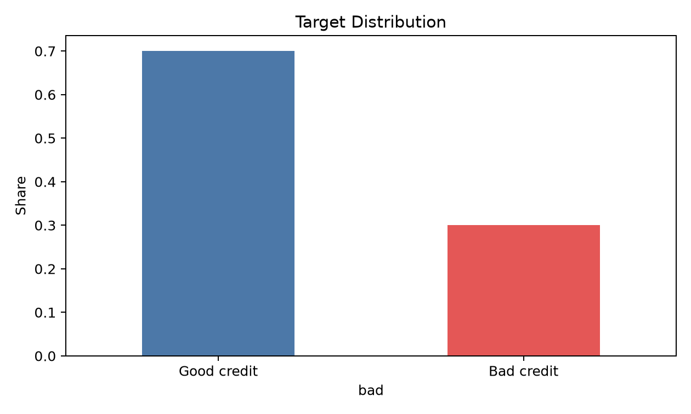
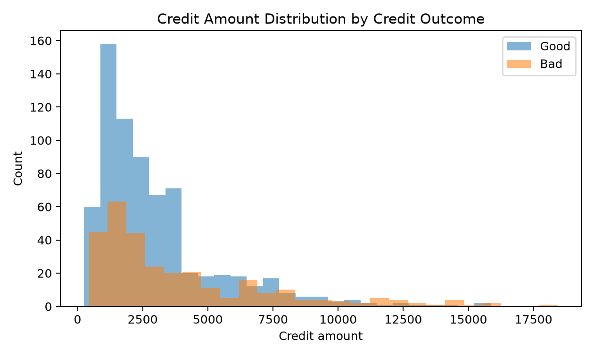
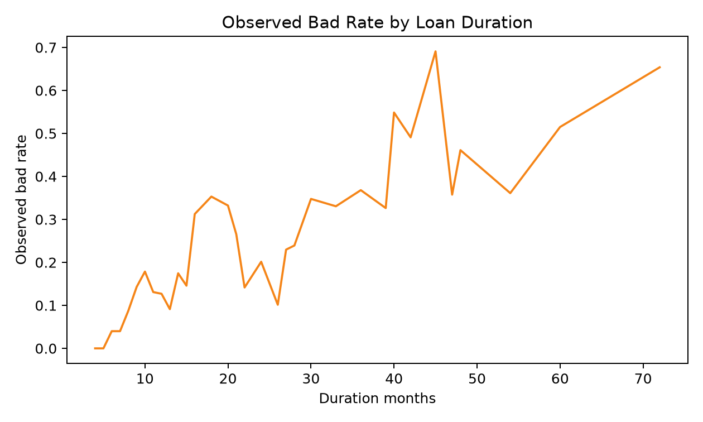
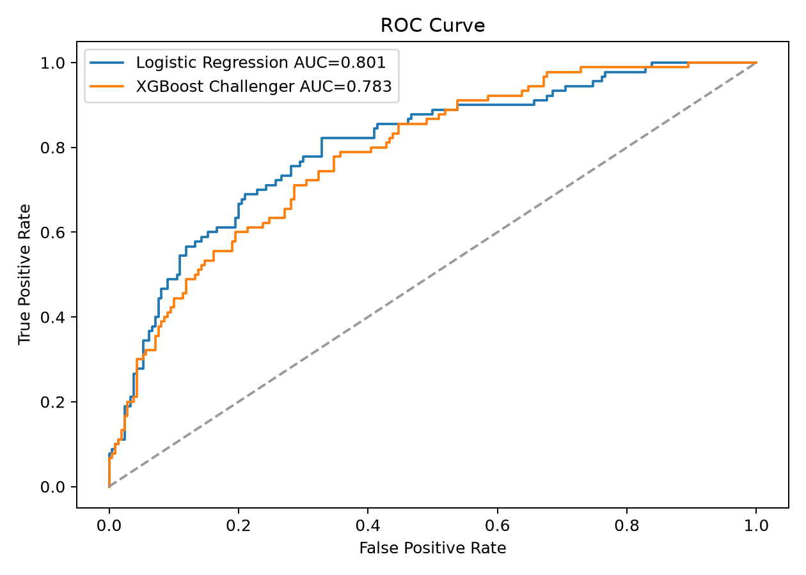
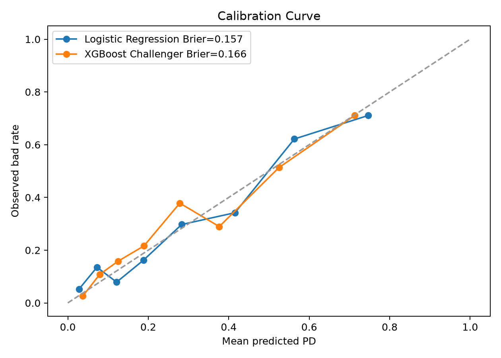
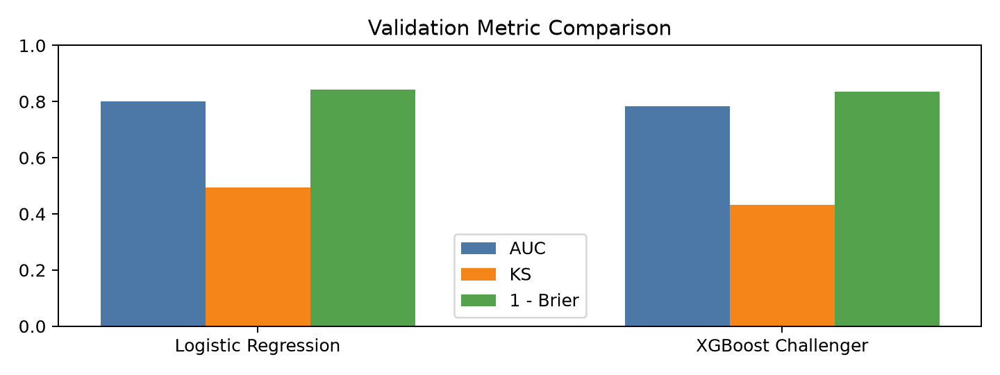
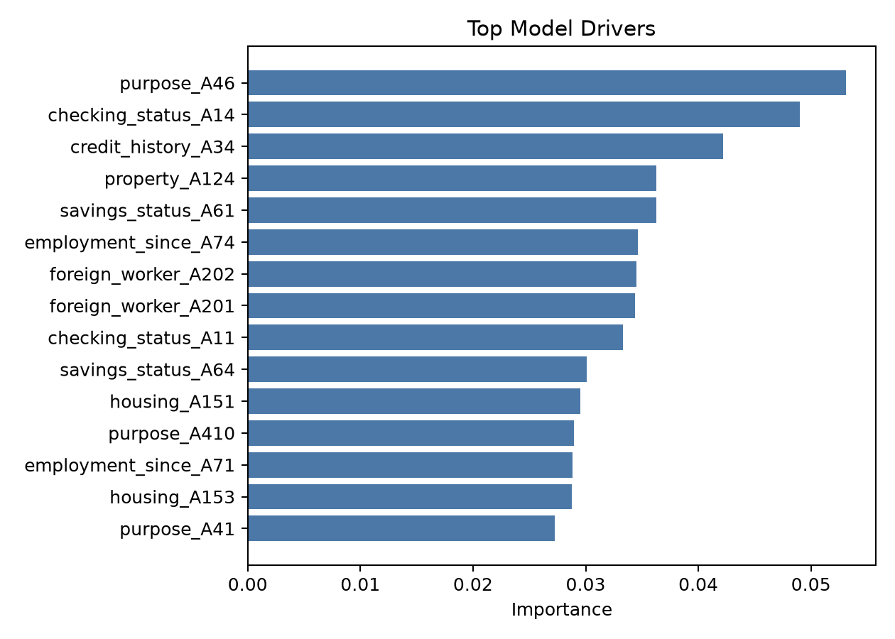
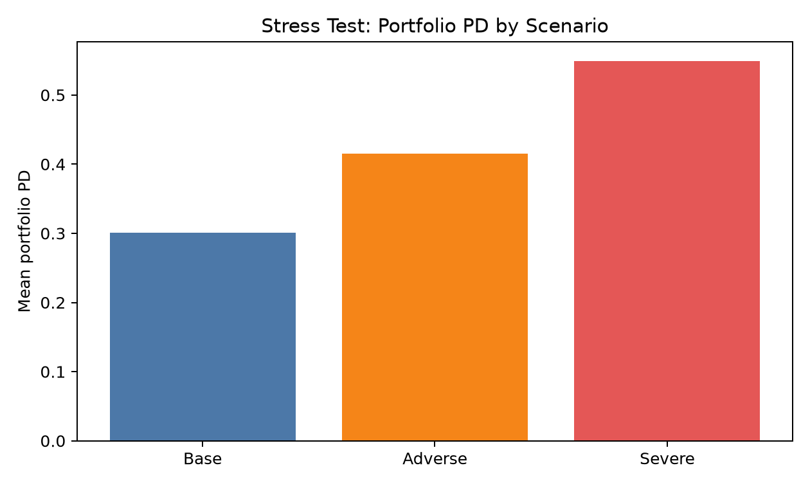
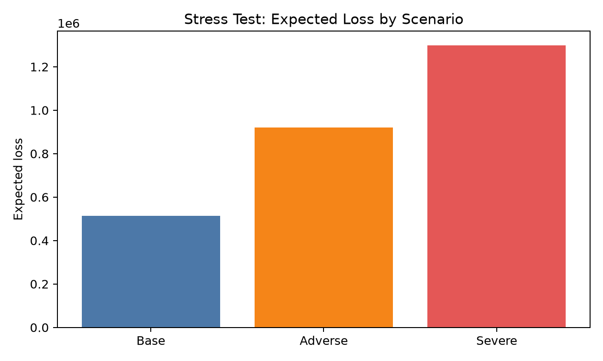

# 信用风险 PD 模型验证与压力测试项目

> Graduate Quantitative Modeling Extension Project  
> Credit Risk PD Model Validation and Stress Testing

## 1. 项目背景与动机

本项目是一个研究生阶段量化建模拓展项目，目标是模拟金融机构模型验证分析师对信用风险 PD（Probability of Default，违约概率）模型进行独立验证的完整流程。

我此前的经历主要集中在机器学习模型、数学建模和模型评估。例如，在“华为杯”研究生数学建模竞赛中，我曾围绕区域双碳目标与路径规划开展预测建模、多情景分析和模型局限性评价；在算法实习和工作经历中，也接触过模型训练、模型选型、自动化测试和结果评估。

在进一步了解模型风险管理（Model Risk Management, MRM）后，我发现模型验证关注的不只是“模型能否预测”，还包括：

- 模型假设是否合理；
- 数据质量是否可靠；
- 模型结果是否稳定；
- 预测概率是否校准；
- 是否存在误用风险；
- 模型局限性是否被充分识别和文档化。

因此，本项目选择银行风险管理中典型的信用风险 PD 模型作为切入点，基于公开数据集完成模型开发、模型验证、压力测试、Expected Loss 计算和验证报告撰写。

本项目不是生产级银行项目，也不使用真实银行内部数据。它的定位是一个可复现的 academic / self-directed project，用于展示对信用风险模型验证流程的理解。

## 2. 项目目标

本项目希望回答以下问题：

1. 如何基于借款人信息构建一个 PD 模型？
2. 如何从模型验证视角评估模型，而不是只看分类准确率？
3. Logistic Regression 和 XGBoost 作为 baseline / challenger model 时，应该如何比较？
4. 为什么信用风险 PD 模型不仅要看 AUC，也要看 calibration？
5. 如何设计简化版压力情景，并分析组合 PD 与 Expected Loss 的变化？
6. 如何形成一份结构化的模型验证报告？

## 3. 初学者术语表

为了方便没有金融风险背景的读者理解，先解释本项目中反复出现的核心术语。

| 术语 | 英文 | 简单解释 | 在本项目中的作用 |
|---|---|---|---|
| 信用风险 | Credit Risk | 借款人无法按约还款而导致损失的风险 | 本项目研究的风险类型 |
| PD | Probability of Default | 违约概率，或被判为 bad credit 的概率 | 模型直接预测的核心结果 |
| LGD | Loss Given Default | 违约后损失率 | 本项目假设为 45%，用于计算 Expected Loss |
| EAD | Exposure at Default | 违约时风险暴露 | 本项目用 `credit_amount` 近似 |
| Expected Loss | EL | 预期损失，常用公式为 `PD x LGD x EAD` | 衡量组合层面的预期信用损失 |
| Baseline Model | 基准模型 | 简单、可解释、用于比较的参考模型 | 本项目使用 Logistic Regression |
| Challenger Model | 挑战模型 | 用来挑战 baseline 是否足够好的替代模型 | 本项目使用 XGBoost |
| Model Validation | 模型验证 | 独立检查模型是否合理、稳定、可解释、适合用途 | 本项目的核心工作流 |
| Calibration | 概率校准 | 检查预测概率和真实发生率是否一致 | 判断 PD 能否用于风险量化 |
| Stress Testing | 压力测试 | 在不利情景下观察模型和组合风险变化 | 测试组合 PD 和 Expected Loss 的敏感性 |
| Cost-sensitive Threshold | 成本敏感阈值 | 根据误判成本选择分类阈值 | 避免机械使用 0.5 阈值 |

一个非常重要的区分是：

```text
分类模型输出标签：这个客户是 good 还是 bad
PD 模型输出概率：这个客户成为 bad 的概率是多少
```

信用风险模型更关心后者，因为 PD 可以进一步用于 Expected Loss、风险定价、压力测试和资本计量。

## 4. 数据集说明

### 4.1 数据来源

本项目使用 UCI Machine Learning Repository 的 Statlog German Credit Data。

数据集链接：

- UCI German Credit Data: https://archive.ics.uci.edu/dataset/144/statlog%2Bgerman%2Bcredit%2Bdata

原始数据包含 1,000 条借款人记录，每条记录描述一个信贷申请人的信用状态、贷款期限、贷款金额、储蓄账户、就业状态、住房情况等信息。

### 4.2 目标变量定义

原始 `german.data` 文件里的最后一列叫 `target`，它的含义如下：

- `1`: good credit
- `2`: bad credit

为了把问题转化为“预测违约概率（PD）”，本项目新建了一个二分类建模目标 `bad`：

| 原始 target | 原始含义 | 建模目标 bad |
|---:|---|---:|
| 1 | good credit | 0 |
| 2 | bad credit | 1 |

也就是说，**原始标签 `2` 会被映射为 `bad = 1`，原始标签 `1` 会被映射为 `bad = 0`**。

因此模型输出的概率可以解释为借款人的 PD：

```text
PD = P(bad = 1 | borrower features)
```

为什么要做这个映射？

| 做法 | 好处 | 如果不这样做的风险 |
|---|---|---|
| 将 good/bad 转成 `0/1` | 符合二分类模型的标准输入格式 | 原始 `1/2` 容易被误解成有数值大小意义 |
| 将 bad credit 设为正类 `1` | 模型输出 `P(bad=1)` 可直接解释为 PD | 如果正类定义不清，AUC、KS、Calibration 的解释会混乱 |
| 保留原始 target 的解释 | 方便追溯原始数据含义 | 读者可能误以为 `target=1` 和 `bad=1` 是同一回事 |

这一步是信用风险建模里非常关键的“目标定义”。如果目标变量定义错了，后续模型再复杂也没有意义。

### 4.3 原始编码样本如何解读

原始 `german.data` 文件没有表头，每一行由 21 个字段组成。前 20 个字段是借款人特征，第 21 个字段是原始标签 `target`：

```text
target = 1 表示 good credit，在建模时转换为 bad = 0
target = 2 表示 bad credit，在建模时转换为 bad = 1
```

为了让原始编码更容易理解，下面给出 3 条差异较大的样本解析。

#### 示例 1：低金额、短期限、最终为 good credit

原始记录：

```text
A11 6 A34 A43 1169 A65 A75 4 A93 A101 4 A121 67 A143 A152 2 A173 1 A192 A201 1
```

逐字段解释：

| 字段 | 原始值 | 含义 |
|---|---|---|
| checking_status | A11 | 支票账户余额 < 0 DM |
| duration_months | 6 | 贷款期限 6 个月 |
| credit_history | A34 | 关键账户 / 其他地方也有信用记录 |
| purpose | A43 | 用途：radio/television |
| credit_amount | 1169 | 贷款金额 1169 |
| savings_status | A65 | 储蓄账户未知 / 无储蓄账户 |
| employment_since | A75 | 当前工作年限 >= 7 年 |
| installment_rate_pct | 4 | 分期还款占可支配收入比例为 4 |
| personal_status_sex | A93 | 男性，单身 |
| other_debtors | A101 | 无共同借款人/担保人 |
| present_residence_since | 4 | 当前住所居住年限为 4 |
| property | A121 | 房地产 |
| age_years | 67 | 年龄 67 岁 |
| other_installment_plans | A143 | 无其他分期付款计划 |
| housing | A152 | 自有住房 |
| existing_credits | 2 | 当前银行已有信用数量为 2 |
| job | A173 | 技术工/正式雇员 |
| num_dependents | 1 | 需赡养人数为 1 |
| telephone | A192 | 有本人名下登记电话 |
| foreign_worker | A201 | 外籍劳工：是 |
| target | 1 | good credit |

翻译成自然语言：

> 一个 67 岁、男性单身、有长期工作、拥有自住房和房地产、贷款 1169、期限 6 个月、用途为收音机/电视、最终被标记为 good credit 的借款人样本。

#### 示例 2：高金额、长期限、年轻借款人，最终为 bad credit

原始记录：

```text
A12 48 A32 A43 5951 A61 A73 2 A92 A101 2 A121 22 A143 A152 1 A173 1 A191 A201 2
```

逐字段解释：

| 字段 | 原始值 | 含义 |
|---|---|---|
| checking_status | A12 | 支票账户余额 0 到 200 DM |
| duration_months | 48 | 贷款期限 48 个月 |
| credit_history | A32 | 现有贷款均按期偿还 |
| purpose | A43 | 用途：radio/television |
| credit_amount | 5951 | 贷款金额 5951 |
| savings_status | A61 | 储蓄账户 < 100 DM |
| employment_since | A73 | 当前工作年限 1 到 4 年 |
| installment_rate_pct | 2 | 分期还款占可支配收入比例为 2 |
| personal_status_sex | A92 | 女性，离异/分居/已婚 |
| other_debtors | A101 | 无共同借款人/担保人 |
| present_residence_since | 2 | 当前住所居住年限为 2 |
| property | A121 | 房地产 |
| age_years | 22 | 年龄 22 岁 |
| other_installment_plans | A143 | 无其他分期付款计划 |
| housing | A152 | 自有住房 |
| existing_credits | 1 | 当前银行已有信用数量为 1 |
| job | A173 | 技术工/正式雇员 |
| num_dependents | 1 | 需赡养人数为 1 |
| telephone | A191 | 无本人名下登记电话 |
| foreign_worker | A201 | 外籍劳工：是 |
| target | 2 | bad credit |

翻译成自然语言：

> 一个 22 岁、女性、工作年限 1 到 4 年、贷款 5951、期限 48 个月、用途为收音机/电视、储蓄账户较低、无本人名下电话、最终被标记为 bad credit 的借款人样本。

#### 示例 3：有担保人、租房、存在其他银行分期计划，最终为 bad credit

原始记录：

```text
A11 16 A34 A40 2625 A61 A75 2 A93 A103 4 A122 43 A141 A151 1 A173 1 A192 A201 2
```

逐字段解释：

| 字段 | 原始值 | 含义 |
|---|---|---|
| checking_status | A11 | 支票账户余额 < 0 DM |
| duration_months | 16 | 贷款期限 16 个月 |
| credit_history | A34 | 关键账户 / 其他地方也有信用记录 |
| purpose | A40 | 用途：new car |
| credit_amount | 2625 | 贷款金额 2625 |
| savings_status | A61 | 储蓄账户 < 100 DM |
| employment_since | A75 | 当前工作年限 >= 7 年 |
| installment_rate_pct | 2 | 分期还款占可支配收入比例为 2 |
| personal_status_sex | A93 | 男性，单身 |
| other_debtors | A103 | 有担保人 |
| present_residence_since | 4 | 当前住所居住年限为 4 |
| property | A122 | 建房储蓄协议/人寿保险 |
| age_years | 43 | 年龄 43 岁 |
| other_installment_plans | A141 | 其他分期付款计划：银行 |
| housing | A151 | 租房 |
| existing_credits | 1 | 当前银行已有信用数量为 1 |
| job | A173 | 技术工/正式雇员 |
| num_dependents | 1 | 需赡养人数为 1 |
| telephone | A192 | 有本人名下登记电话 |
| foreign_worker | A201 | 外籍劳工：是 |
| target | 2 | bad credit |

翻译成自然语言：

> 一个 43 岁、男性单身、长期工作但支票账户余额为负、贷款 2625、期限 16 个月、用途为新车、有担保人、租房、还存在其他银行分期付款计划、最终被标记为 bad credit 的借款人样本。

### 4.4 特征类型

数值型变量包括：

- `duration_months`
- `credit_amount`
- `installment_rate_pct`
- `present_residence_since`
- `age_years`
- `existing_credits`
- `num_dependents`

类别型变量包括：

- `checking_status`
- `credit_history`
- `purpose`
- `savings_status`
- `employment_since`
- `personal_status_sex`
- `other_debtors`
- `property`
- `other_installment_plans`
- `housing`
- `job`
- `telephone`
- `foreign_worker`

## 5. 项目结构

```text
credit_risk_pd_validation/
  data/
    raw/
      german.data
  outputs/
    figures/
      target_distribution.png
      credit_amount_distribution.png
      bad_rate_by_duration.png
      roc_curve.png
      calibration_curve.png
      metric_comparison.png
      feature_importance.png
      stress_pd.png
      stress_expected_loss.png
    credit_risk_pd_model_validation_report.pdf
    model_validation_metrics.csv
    stress_testing_results.csv
    feature_importance.csv
    metrics_summary.json
  src/
    run_credit_risk_validation.py
  README.md
  PROJECT_WALKTHROUGH_ZH.md
  interview_notes_zh.md
  requirements.txt
```

## 6. 环境与依赖

项目主要依赖：

```text
pandas
numpy
scikit-learn
matplotlib
xgboost
reportlab
```

安装依赖：

```bash
pip install -r requirements.txt
```

运行项目：

```bash
python src/run_credit_risk_validation.py
```

运行后会自动生成：

- 模型验证指标 CSV；
- 压力测试结果 CSV；
- 特征重要性 CSV；
- 图表；
- PDF 模型验证报告；
- JSON 指标摘要。

## 7. 操作流程总览

整个项目流程如下：

```text
读取数据
  -> 定义 bad = 1 的 PD 建模目标
  -> 数据质量与探索性分析
  -> 构建 Logistic Regression baseline
  -> 构建 XGBoost challenger model
  -> 评估 AUC / KS / Brier / Calibration / CV stability
  -> 基于 cost matrix 选择阈值
  -> 比较 baseline 与 challenger
  -> 分析模型驱动因素
  -> 构造 Base / Adverse / Severe 压力情景
  -> 计算 PD / LGD / EAD / Expected Loss
  -> 输出模型验证报告
```

## 8. 数据探索与质量检查

### 8.1 样本分布

首先检查 good credit 和 bad credit 的比例。



从图中可以看到，数据集中 good credit 占比约 70%，bad credit 占比约 30%。这意味着样本存在一定类别不平衡，但并非极端不平衡。

在信用风险建模中，目标变量分布非常重要。如果坏样本比例过低，模型可能倾向于预测大多数样本为好客户，从而在准确率上看似较高，但实际无法识别风险客户。因此本项目没有使用 accuracy 作为核心指标，而是重点关注：

- AUC；
- KS；
- Brier Score；
- Calibration Curve；
- Cost-sensitive threshold。

为什么不把 accuracy 作为核心指标？

假设 100 个客户里只有 5 个坏客户，一个模型永远预测“所有客户都是好客户”，它的 accuracy 也有 95%。但这个模型对信用风险管理几乎没有价值，因为它完全识别不出坏客户。

因此，在信用风险建模中，我们更关心：

```text
坏客户是否被排在更高风险位置？
预测 PD 是否接近真实坏账率？
漏掉坏客户的成本是否被考虑？
```

这也是本项目选择 AUC、KS、Brier Score、Calibration Curve 和 Cost-sensitive threshold 的原因。

### 8.2 贷款金额分布



贷款金额是信用风险中非常重要的变量，因为它不仅影响违约风险，也影响违约后的风险暴露 EAD。在本项目中，后续 Expected Loss 计算使用 `credit_amount` 近似 EAD。

为什么可以用 `credit_amount` 近似 EAD？

在真实银行模型中，EAD 通常需要单独估计，尤其是循环授信、信用卡或未使用额度场景。但 German Credit Data 是一个简化公开数据集，没有完整的授信额度、提款行为和还款计划信息。因此，本项目用贷款金额作为 EAD 的近似值。

这样做的好处是：

- 可以演示 `PD x LGD x EAD` 的风险参数框架；
- 可以让读者看到 PD 模型如何连接到 Expected Loss；
- 保持项目范围适中，避免引入无法从数据中支持的复杂假设。

不这样做的坏处是：项目只能停留在“分类模型”，无法展示信用风险模型如何转化为损失估计。

但必须说明，这只是教学/展示用途的近似，不应理解为生产级 EAD 模型。

### 8.3 贷款期限与坏账率



贷款期限越长，借款人未来状态的不确定性越高，因此在很多信用风险场景中，较长期限可能对应更高风险。本项目通过 observed bad rate by duration 对这一关系进行探索。

## 9. 特征工程与预处理

项目中对数值变量和类别变量分别进行预处理。

### 9.1 数值变量处理

数值变量使用：

```text
SimpleImputer(strategy="median")
StandardScaler()
```

处理逻辑：

- 使用中位数填补缺失值；
- 使用标准化让不同量纲的数值变量处于可比较尺度；
- 对 Logistic Regression 尤其重要，因为线性模型对特征尺度更敏感。

为什么要标准化数值变量？

不同数值变量的量纲差异很大。例如：

```text
credit_amount 可能是几千
duration_months 可能是几十
existing_credits 可能只有 1 或 2
```

如果不做标准化，Logistic Regression 在优化时可能受到变量尺度影响，导致模型训练不稳定或系数解释困难。

标准化的好处：

- 提高线性模型训练稳定性；
- 让不同数值特征处于可比较尺度；
- 降低某些大尺度变量在优化过程中的不必要影响。

不做标准化的风险：

- 模型收敛更慢；
- 系数大小难以比较；
- 对线性模型和距离敏感模型尤其不友好。

### 9.2 类别变量处理

类别变量使用：

```text
SimpleImputer(strategy="most_frequent")
OneHotEncoder(handle_unknown="ignore")
```

处理逻辑：

- 使用众数填补缺失值；
- 使用 One-Hot Encoding 将类别变量转换为模型可处理的数值矩阵；
- `handle_unknown="ignore"` 可以避免测试集或未来数据中出现未知类别时报错。

为什么要使用 One-Hot Encoding？

像 `A43`、`A65`、`A152` 这样的编码只是类别，不是连续数值。

如果直接把它们转成 43、65、152 这样的数字，模型可能误以为：

```text
A65 > A43
A152 比 A65 大很多
```

但这在业务上没有意义。`A43` 只是“radio/television”，`A40` 只是“new car”，它们之间不存在大小关系。

One-Hot Encoding 的好处是：

- 保留类别变量的离散属性；
- 避免模型误解编码大小；
- 让线性模型和树模型都能处理类别信息。

不做 One-Hot Encoding 的风险是：模型可能学到虚假的数值顺序关系。

### 9.3 训练集与测试集划分

项目使用 stratified train/test split：

```text
test_size = 0.30
random_state = 42
stratify = y
```

使用 stratify 的原因是保持训练集和测试集中 bad credit 比例一致，避免由于随机划分导致测试集风险分布偏移。

为什么要划分训练集和测试集？

训练集用于模型学习，测试集用于模拟“未见过的新客户”。如果只在训练集上评估模型，就像学生做完练习题后又用同一批题考试，结果会过于乐观。

为什么要 `stratify = y`？

因为坏样本只有约 30%。如果随机划分刚好让测试集坏样本比例偏高或偏低，验证指标会受到样本分布影响。分层抽样可以让训练集和测试集的 good/bad 比例保持接近。

不这样做的风险：

- 测试结果不稳定；
- 模型看起来好或坏，可能只是因为测试集分布偶然偏移；
- 对小样本数据尤其敏感。

## 10. 模型设计

本项目构建两个模型：

1. Logistic Regression baseline
2. XGBoost challenger model

### 10.1 Logistic Regression Baseline

Logistic Regression 在信用风险建模中具有较强解释性，常被用于传统信用评分场景。

优点：

- 模型结构简单；
- 输出概率自然可解释为 PD；
- 系数方向可以辅助解释变量影响；
- 更容易进行模型治理和验证。

在模型验证语境下，baseline model 的价值不是追求复杂度，而是提供一个清晰、可解释、可挑战的参考模型。

为什么选择 Logistic Regression 作为 baseline？

信用风险模型不是越复杂越好。对于模型验证岗位来说，一个模型是否适合使用，还取决于：

- 是否能解释；
- 是否稳定；
- 是否便于监控；
- 是否容易被业务和风险团队理解；
- 是否符合模型治理要求。

Logistic Regression 的好处是：

- 输出天然是概率；
- 结构简单，便于解释；
- 可作为 challenger model 的参照物；
- 更容易讨论变量方向和业务合理性。

如果没有 baseline，直接使用复杂模型，会带来一个问题：即使模型表现不错，也很难判断它相对简单模型到底带来了多少增益。

### 10.2 XGBoost Challenger Model

XGBoost 用作 challenger model，用于检验非线性关系和变量交互是否能提升预测表现。

优点：

- 能捕捉非线性关系；
- 能处理复杂变量交互；
- 通常具有较强预测能力。

但在模型风险管理中，复杂模型也带来额外挑战：

- 可解释性更弱；
- 校准可能不稳定；
- 治理成本更高；
- 需要更多监控和文档支持。

因此，本项目不会简单地认为“复杂模型一定更好”，而是从 AUC、KS、Brier、校准、稳定性和可解释性多个角度比较两个模型。

为什么还要加 XGBoost challenger？

只使用 Logistic Regression 可能会遗漏非线性关系。例如，贷款期限和储蓄状态之间可能存在交互效应。XGBoost 可以作为 challenger model，帮助回答：

```text
更复杂的模型是否显著提升了验证指标？
如果提升不明显，是否值得承担更高解释成本？
```

这样做的好处：

- 让模型选择更有证据；
- 避免只凭直觉说简单模型够用；
- 体现模型验证中的 benchmarking 思维。

不做 challenger 的风险：

- 无法证明 baseline 已经足够好；
- 面试时容易被问：“你怎么知道没有更好的模型？”

## 11. 模型验证指标

### 11.1 AUC

AUC 衡量模型对好坏客户的排序能力。AUC 越高，说明模型越能把高风险客户排在低风险客户前面。

但 AUC 只反映排序能力，不反映概率是否准确。例如，一个模型可以排序很好，但预测 PD 系统性偏高或偏低。

### 11.2 KS

KS 衡量 good / bad 两类样本累积分布的最大差异，是信用评分模型中常用的区分度指标。

KS 越高，说明模型对好坏客户的分离能力越强。

### 11.3 Brier Score

Brier Score 衡量预测概率与真实结果之间的均方误差。

在 PD 模型中，Brier Score 非常重要，因为 PD 是概率，不只是分类标签。若模型用于 Expected Loss 或风险定价，概率校准质量会直接影响风险估计。

### 11.4 Calibration Curve

Calibration Curve 比较 predicted PD 和 observed bad rate。

如果模型校准良好，那么预测 PD 为 20% 的样本组，其实际坏账率也应接近 20%。

### 11.5 Cross-validation AUC Stability

交叉验证用于观察模型在不同训练/验证划分下的 AUC 稳定性。

如果 CV AUC 标准差过大，说明模型对样本划分敏感，稳定性不足。

### 11.6 Cost-sensitive Threshold

German Credit 数据集附带一个重要设定：将坏客户误判为好客户的成本高于将好客户误判为坏客户。

在本项目中：

```text
False Negative: bad customer predicted as good, cost = 5
False Positive: good customer predicted as bad, cost = 1
```

因此，项目没有默认使用 0.5 作为分类阈值，而是寻找使误判成本最低的 threshold。

为什么不能只看一个指标？

因为不同指标回答的问题不同：

| 指标 | 回答的问题 |
|---|---|
| AUC | 坏客户能不能排在更高风险位置？ |
| KS | 好坏客户分布是否明显分离？ |
| Brier Score | 预测概率是否接近真实结果？ |
| Calibration Curve | 预测 PD 和真实坏账率是否一致？ |
| Cost-sensitive threshold | 在误判成本不对称时，应该用什么阈值？ |

如果只看 AUC，可能选到一个排序不错但概率严重偏差的模型。对于 PD 模型来说，这会影响 Expected Loss 和压力测试结果。

因此，本项目采用多指标验证，更符合模型风险管理中“不能只凭单一指标判断模型可用性”的原则。

## 12. 模型验证结果

模型主要结果如下：

| Model | AUC | KS | Brier | CV AUC Mean | CV AUC Std | Cost Threshold | Expected Cost |
|---|---:|---:|---:|---:|---:|---:|---:|
| Logistic Regression | 0.8011 | 0.4937 | 0.1574 | 0.7640 | 0.0241 | 0.245 | 0.4967 |
| XGBoost Challenger | 0.7834 | 0.4317 | 0.1659 | 0.7713 | 0.0354 | 0.140 | 0.5100 |

### 12.1 ROC 曲线



Logistic Regression 的 AUC 约为 0.801，XGBoost 的 AUC 约为 0.783。从测试集表现看，Logistic Regression 在区分度上略优。

这也说明，在小样本、结构化信用数据上，复杂模型不一定优于简单模型。

### 12.2 Calibration Curve



Calibration Curve 用于观察 predicted PD 与 observed bad rate 的一致性。

本项目中，Logistic Regression 的 Brier Score 为 0.1574，XGBoost 为 0.1659。Brier Score 越低越好，因此 Logistic Regression 在概率校准方面略优。

对于 PD 模型来说，这一点非常重要。因为如果模型只是用于排序，AUC 可能足够；但如果模型输出要用于 Expected Loss 计算，那么 PD 的概率质量必须被验证。

### 12.3 指标对比



综合 AUC、KS、Brier、成本阈值和可解释性，本项目最终选择 Logistic Regression 作为 preferred model。

选择理由：

1. AUC 更高；
2. KS 更高；
3. Brier Score 更低；
4. 可解释性更强；
5. 更适合模型验证报告中的 conceptual soundness 和 governance discussion。

这并不意味着 XGBoost 不好，而是说明 challenger model 没有在综合验证指标上明显超过 baseline。

为什么最终选择 Logistic Regression？

本项目没有机械选择“最复杂”的模型，而是选择综合验证结果更稳的模型。

选择 Logistic Regression 的原因包括：

- AUC 更高；
- KS 更高；
- Brier Score 更低；
- 平均 PD 与样本坏账率更接近；
- 可解释性更强；
- 更适合作为教学型 PD 模型验证案例。

如果只因为 XGBoost 更先进就选择它，会忽略模型风险管理中很重要的一点：模型使用要匹配用途，复杂度必须有足够收益来证明。

## 13. 模型驱动因素分析



模型重要变量包括：

- `purpose_A46`
- `checking_status_A14`
- `credit_history_A34`
- `property_A124`
- `savings_status_A61`
- `employment_since_A74`
- `foreign_worker_A202`
- `checking_status_A11`

在真实模型验证中，特征重要性分析只是第一步，还需要进一步检查：

- 变量方向是否符合业务逻辑；
- 是否存在代理变量或合规风险；
- 是否存在稳定性问题；
- 是否需要 reason code；
- 是否存在公平性或歧视性风险。

本项目作为 academic project，没有展开公平性测试，但在验证报告中将其列为后续改进方向。

为什么要看模型驱动因素？

模型验证不只是看指标，还要问：

```text
模型为什么这样预测？
关键变量是否符合业务常识？
模型是否依赖了不稳定或不合规的变量？
```

如果一个模型 AUC 很高，但主要依赖一个业务上不合理或不可解释的变量，那么它仍然可能存在模型风险。

特征重要性分析的好处：

- 帮助理解模型判断依据；
- 支持 conceptual soundness review；
- 为后续变量稳定性和公平性检查提供线索。

不做特征分析的风险：

- 模型变成黑箱；
- 无法解释模型为何拒绝或批准某类客户；
- 难以发现潜在的数据泄露或代理变量风险。

## 14. 压力测试设计

### 14.1 压力测试动机

信用风险模型不应只在正常样本分布下被评估，也需要观察在不利情景下组合风险如何变化。

本项目构造三个情景：

| Scenario | Description |
|---|---|
| Base | 原始组合 |
| Adverse | 部分高风险客户贷款金额、期限和风险状态恶化 |
| Severe | 更大比例、更强幅度的风险恶化 |

### 14.2 压力变量设计

压力情景主要调整：

- `credit_amount`
- `duration_months`
- `checking_status`
- `savings_status`
- `employment_since`
- `credit_history`
- `property`

设计逻辑是：当宏观或借款人状态恶化时，贷款期限、贷款金额和信用状态可能同时变差，从而推高组合 PD。

需要强调：这不是正式 CCAR 压力测试模型，而是 educational scenario analysis。真实监管压力测试需要宏观变量、情景路径、治理流程和更严格的模型验证。

为什么要做压力测试？

普通测试集评估回答的是：

```text
模型在当前样本分布下表现如何？
```

压力测试进一步回答：

```text
如果组合质量恶化，模型预测的风险和损失会如何变化？
```

这样做的好处：

- 检查模型输出对风险因素变化是否敏感；
- 展示 PD 如何影响组合 Expected Loss；
- 更接近银行风险管理中的情景分析思维。

不做压力测试的风险：

- 只能说明模型在历史样本中表现如何；
- 无法展示不利情景下组合风险变化；
- 简历项目与 stress testing / CCAR 的连接会变弱。

## 15. Basel 风格 Expected Loss 映射

本项目使用简化的 Basel 风格风险参数框架：

```text
Expected Loss = PD x LGD x EAD
```

其中：

- PD: 模型预测的违约概率；
- LGD: 假设为 45%；
- EAD: 使用 credit amount 近似。

在真实银行场景中，LGD 和 EAD 通常需要单独建模或验证，本项目为了聚焦 PD 模型验证，对 LGD 和 EAD 做了简化处理。

为什么要引入 Expected Loss？

如果项目只停留在“预测 bad/good”，它更像普通机器学习分类项目。引入 Expected Loss 后，项目才真正连接到信用风险管理。

```text
PD 告诉我们违约可能性
LGD 告诉我们违约后损失比例
EAD 告诉我们违约时暴露金额
Expected Loss 把三者合成预期损失
```

这样做的好处：

- 让模型输出和金融风险指标连接起来；
- 展示 Basel 风格风险参数理解；
- 让压力测试结果更有业务含义。

不这样做的坏处：

- 项目容易被看成普通分类练习；
- 无法体现 PD/LGD/EAD 这些岗位关键词；
- 不利于面试中解释“模型结果如何服务风险管理”。

## 16. 压力测试结果

| Scenario | Mean PD | Portfolio EAD | Expected Loss | PD Uplift vs Base | EL Uplift vs Base |
|---|---:|---:|---:|---:|---:|
| Base | 0.3008 | 3,271,258 | 514,878 | 0.0000 | 0.0000 |
| Adverse | 0.4156 | 3,440,094 | 921,262 | 0.3818 | 0.7893 |
| Severe | 0.5491 | 3,896,741 | 1,298,799 | 0.8257 | 1.5225 |

### 16.1 组合 PD 压力测试



Base 情景下平均 PD 约为 30.1%，与样本坏账率 30.0% 接近，说明 Logistic Regression 的整体概率水平较合理。

在 Adverse 情景下，平均 PD 上升至约 41.6%；在 Severe 情景下，平均 PD 上升至约 54.9%。

### 16.2 Expected Loss 压力测试



Expected Loss 在压力情景下显著上升。Severe 情景下 EL uplift 超过 150%。

这说明：

- PD 上升会推高风险损失；
- EAD 上升会进一步放大损失；
- 组合风险对 borrower quality 和 exposure 同时敏感。

## 17. 模型验证报告

项目自动生成 PDF 验证报告：

```text
outputs/credit_risk_pd_model_validation_report.pdf
```

报告结构包括：

1. Executive Summary
2. Model Purpose and Intended Use
3. Data Description and Data Quality Review
4. Methodology Review
5. Model Performance Testing
6. Calibration and Discrimination Analysis
7. Benchmarking
8. Stress Testing and Sensitivity Analysis
9. Model Limitations
10. Validation Findings and Recommendations

该结构参考了模型风险管理中的常见验证逻辑，尤其是：

- conceptual soundness；
- outcomes analysis；
- benchmarking；
- model limitations；
- validation documentation。

参考资料：

- Federal Reserve SR 11-7 Model Risk Management Guidance: https://www.federalreserve.gov/supervisionreg/srletters/sr1107.htm
- Basel II Comprehensive Version, BIS: https://www.bis.org/publ/bcbs128.pdf

为什么要生成验证报告？

模型验证岗不只是跑代码，还要把验证过程写清楚，让模型开发者、业务方、风险管理团队和审查人员都能理解：

```text
模型做什么？
数据从哪里来？
方法是否合理？
测试结果如何？
有哪些局限？
是否建议使用？
需要哪些整改？
```

报告的好处：

- 体现 documentation 能力；
- 体现 independent validation 的工作流；
- 让项目更像模型风险管理项目，而不是单纯 notebook；
- 面试时可以作为讲解材料。

不写报告的风险：

- 项目只剩代码和指标，缺少模型验证岗位最看重的文档化能力；
- 很难体现 effective challenge 和 limitation analysis。

## 18. 主要验证发现

### Finding 1: Logistic Regression 综合表现优于 XGBoost challenger

虽然 XGBoost 是更复杂的非线性模型，但在本项目测试集上，Logistic Regression 的 AUC、KS 和 Brier Score 表现更好。

这说明在小样本信用风险数据中，复杂模型不一定带来更优的验证结果。

### Finding 2: PD 模型必须关注校准

AUC 只能说明排序能力，不能说明概率是否准确。

对于信用风险 PD 模型，如果输出概率要用于 Expected Loss、风险定价或资本计量，就必须检查 calibration。

### Finding 3: 成本敏感阈值比默认 0.5 更合理

在信用风险中，错把坏客户判断为好客户通常比错拒好客户成本更高。因此本项目使用 cost matrix 寻找成本最小化阈值。

### Finding 4: 压力情景下组合风险显著上升

在 Adverse 和 Severe 情景下，组合平均 PD 和 Expected Loss 均显著上升，说明模型能够反映压力情景下的风险变化。

### Finding 5: 项目存在明确局限性

本项目使用公开小样本数据集，没有真实银行业务数据、时间序列 out-of-time validation、宏观变量或生产级监控数据。因此它不能用于真实授信决策。

## 19. 项目局限性

本项目的主要局限包括：

1. 数据集规模较小，仅 1,000 条样本；
2. 没有时间维度，无法做真正的 out-of-time validation；
3. 缺少宏观经济变量，压力测试为规则化情景设计；
4. LGD 固定为 45%，没有单独建模；
5. EAD 使用 credit amount 近似，较为简化；
6. 没有进行 fairness、bias、reject inference 等更深入验证；
7. 不是生产级银行模型，不能直接用于真实风险决策。

这些局限性并不削弱项目价值，反而体现模型验证中的一个重要原则：模型使用边界必须被清楚识别和记录。

为什么要主动写局限性？

初学者容易以为项目文档应该只写优点，但模型验证恰恰非常重视局限性。

因为模型一旦进入真实业务，风险往往来自：

- 数据不适用；
- 假设过强；
- 样本外表现不稳定；
- 使用场景被扩大；
- 变量解释不充分；
- 监控机制不足。

主动说明局限性有两个好处：

1. 展示你理解模型风险；
2. 避免面试官认为你把公开数据练习包装成生产级模型。

## 20. 面试讲解口径

可以用下面这段话介绍项目：

```text
这个项目是我研究生阶段做量化建模和模型评估时的一个拓展项目，不是企业生产项目。
我之前做过数学建模竞赛、机器学习模型训练和模型评估，因此进一步选择信用风险 PD 模型这个金融风险典型场景，系统练习模型验证流程。
项目中我使用 Logistic Regression 作为可解释 baseline，XGBoost 作为 challenger model，从数据质量、AUC、KS、校准、交叉验证、误判成本、压力测试和模型局限性角度进行验证，并输出模型验证报告。
我希望通过这个项目证明，我不仅会训练模型，也理解模型风险管理中 effective challenge、quantitative testing 和 documentation 的要求。
```

## 21. 简历写法

中文版本：

```text
研究生阶段量化建模拓展项目：信用风险 PD 模型验证与压力测试
- 在研究生阶段数学建模与机器学习模型评估经历基础上，选取金融风险中典型的信用风险 PD 模型作为拓展方向，基于 UCI German Credit Data 构建并验证借款人违约概率模型。
- 使用 Logistic Regression 作为可解释 baseline，XGBoost 作为 challenger model，从数据质量、变量合理性、模型区分度、校准效果、交叉验证稳定性和误判成本角度开展模型验证。
- 使用 AUC、KS、Brier Score、Calibration Curve、Confusion Matrix 等指标评估模型表现，并比较模型在预测能力、概率校准和可解释性方面的差异。
- 设计 Base/Adverse/Severe 压力情景，分析组合 PD 与 Expected Loss 的变化，并基于 PD/LGD/EAD 框架计算预期损失。
- 输出模型验证报告，覆盖方法论、测试结果、benchmark、模型局限性和改进建议。
```

英文版本：

```text
Graduate Quantitative Modeling Extension Project: Credit Risk PD Model Validation and Stress Testing
- Built and independently validated borrower-level probability of default models using UCI German Credit Data, extending prior graduate-level modeling and machine learning evaluation experience into a credit risk model validation setting.
- Used Logistic Regression as an interpretable baseline and XGBoost as a challenger model; evaluated data quality, variable reasonableness, discrimination, calibration, cross-validation stability, and cost-sensitive thresholds.
- Assessed model performance using AUC, KS, Brier Score, calibration curves, confusion matrix analysis, and benchmarking between baseline and challenger models.
- Designed base/adverse/severe stress scenarios and mapped PD to expected loss using Basel-style PD/LGD/EAD concepts.
- Produced a validation report covering methodology, test results, benchmarking, model limitations, and recommendations.
```

## 22. 如何复现

### 22.1 安装依赖

```bash
pip install -r requirements.txt
```

### 22.2 运行脚本

```bash
python src/run_credit_risk_validation.py
```

### 22.3 查看输出

```text
outputs/
  credit_risk_pd_model_validation_report.pdf
  model_validation_metrics.csv
  stress_testing_results.csv
  feature_importance.csv
  metrics_summary.json
  figures/
```

## 23. 总结

本项目的核心价值不是证明模型有多复杂，而是展示一套完整的模型验证思维：

- 明确模型用途；
- 检查数据质量；
- 构建 baseline 和 challenger；
- 使用多维指标验证模型；
- 关注概率校准；
- 进行压力测试；
- 识别模型局限；
- 输出验证报告。

这与 Quantitative Risk / Model Validation 岗位中的工作要求高度相关，尤其是信用风险模型、定量测试、压力测试、模型文档和模型局限性分析。
